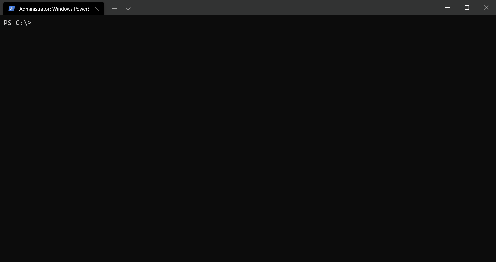

# Watch-Command
The `Watch-Command` is a PowerShell semi-equivalent of the respective Linux Watch utility. The `Watch-Command` cmdlet runs command repeatedly, displaying its output and errors.  This allows you to watch the program output change over time. By default, command is ran every 2 seconds and watch will run until interrupted.

# Installation
1. Clone this repo: `git clone https://github.com/danieldavidson/Watch-Command.git`
2. Import the function: `Import-Module Watch-Command.ps1`

